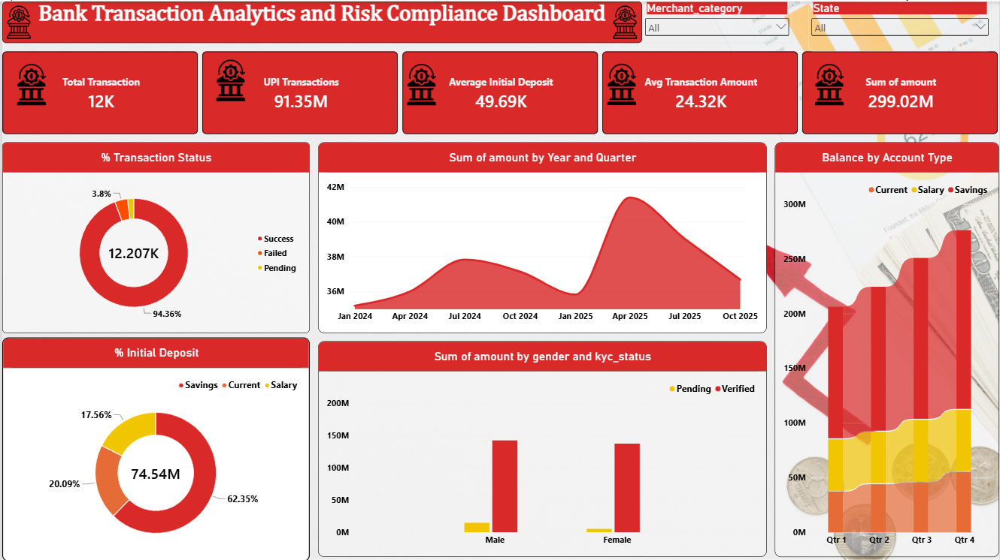

# Bank-transactions-analytics
Bank Transactions &amp; Account Holders Analytics using MySQL and Power BI
# Bank Transactions & Account Holders Analytics

## 📌 Project Overview

This project analyzes bank account and transaction data to identify transaction trends, account activity, payment method performance, and key business insights.

The project was developed using **MySQL and Power BI** as a team-based Data Analytics project.

## 🛠️ Tools & Technologies

- **MySQL** – Data querying and analysis
- **Power BI** – Interactive dashboard and visualization
- **Power Query** – Data cleaning and transformation
- **DAX** – Creating calculated measures
- **Excel/CSV** – Dataset storage and preparation

## 📊 Dataset

The project contains:

- **1,500** account records
- **12,207** transaction records
- Approximately **2 years** of transaction data

The dataset contains information related to accounts, transactions, transaction amounts, transaction status, payment methods, and transaction dates.

> **Note:** The dataset is simulated and created for educational and portfolio purposes.

## 🔍 SQL Analysis

MySQL was used to analyze the data and answer business-related questions.

Key SQL concepts used:

- SELECT and filtering
- WHERE and HAVING
- GROUP BY
- ORDER BY
- CASE WHEN
- Aggregate functions
- INNER JOIN
- LEFT JOIN
- Subqueries
- CTEs
- Window functions
- Views
- Indexes

  ### 📂 SQL Files

- [Database Setup](SQL/01_database_and_tables)
- [Data Validation](SQL/03_exploratory_data_analysis)
- [Business Insights Queries](SQL/04_business_insights_queries)


## 📈 Power BI Dashboard

The Power BI dashboard provides an interactive view of banking transaction performance.

### Key KPIs

- Total Transactions
- Total Transaction Value
- Successful Transactions
- Failed Transactions
- Pending Transactions
- Transaction Success Rate

### Dashboard Analysis

The dashboard analyzes:

- Monthly transaction trends
- Transaction status
- Payment method performance
- Account activity
- Transaction value
- Transaction volume
- Customer/account-level performance

### 📸 Dashboard Preview


## 📁 Project Structure

```text
bank-transactions-analytics/
│
├── Dataset/
│   ├── accounts.csv
│   └── transactions.csv
│
├── SQL/
│   ├── database_setup.sql
│   ├── data_cleaning.sql
│   ├── business_insights_queries.sql
│   └── advanced_queries.sql
│
├── PowerBI/
│   └── Bank_Transactions_Dashboard.pbix
│
├── Dashboard/
│   ├── dashboard_page1.png
│   ├── dashboard_page2.png
│   └── dashboard_page3.png
│
├── Documentation/
│   ├── Project_Insights.pdf
│   └── Data_Dictionary.xlsx
│
└── README.md
```

## 🎯 Business Objective

The main objective of this project is to use SQL and Power BI to transform raw banking transaction data into meaningful insights that can support business decision-making and performance monitoring.

## 👥 Project Type

**Team Project**

My contribution focused primarily on:

- SQL data analysis
- Business insight queries
- Data validation
- Power BI reporting support
- Dashboard analysis

## 📌 Conclusion

This project demonstrates practical skills in **SQL, data analysis, Power BI, data visualization, and business reporting** by converting raw banking data into actionable insights.
